# ToDo - Android
> This application makes it easy to manage your task list on Android phones & tablets.

This application allows you to add important or non-important tasks to your task list.
With a click on one of your tasks, you can mark it as finished or modify it at your convenience !

You can also mark as "Done" the whole of your list of tasks and thus empty your list.

This application not requires a network connection to work.

## Features

- [x] Simple ToDo List (with important tasks or not).
- [x] Simple press to modify a task.
- [x] Long press to delete, edit, cancal or done a task.
- [x] Ready to Publish.
- [x] Language : English.

## Requirements

- Android Studio 3.1+
- Android 4.4+

## Usage

If you just want to install this application on your device, follow this instructions.

1. Download the .APK on this link : 
`https://github.com/jagito97/todo_and_note/blob/master/app_build_debug/app-debug.apk`

2. Install this .APK on your device

3. Enjoy and put a star !

## Installation (for developers)

1. Clone this project in your project folder : `git clone https://github.com/WestFR/ToDoList-Android`

2. Open this project thank your Android Studio and make one `Build Gradle Sync`

3. Enjoy (and develop your specific function)

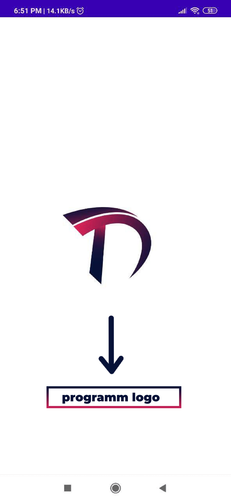 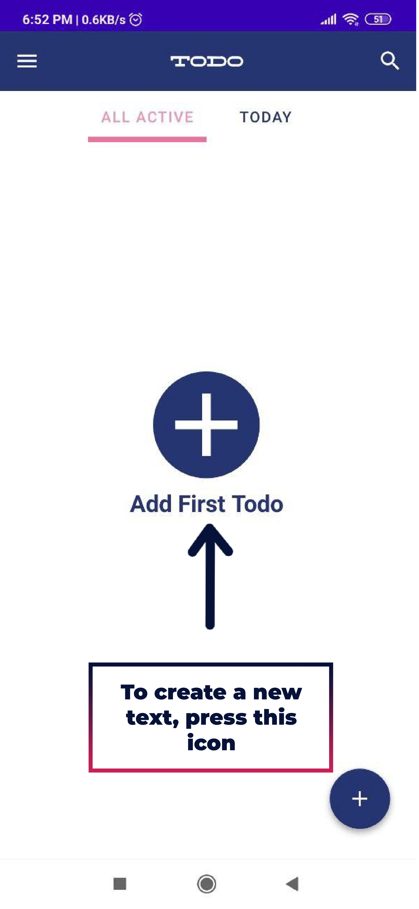

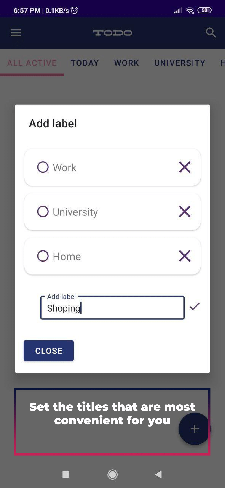 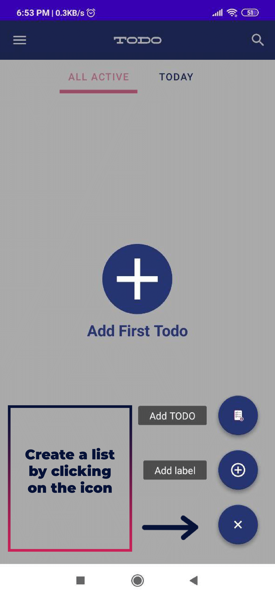

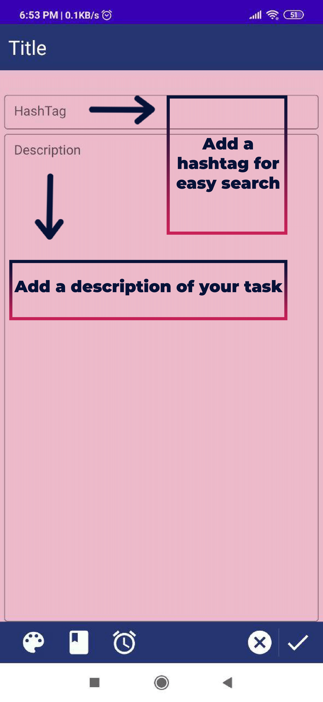 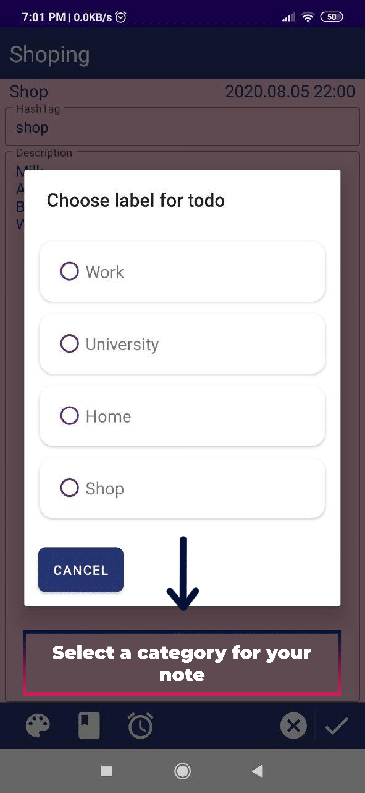

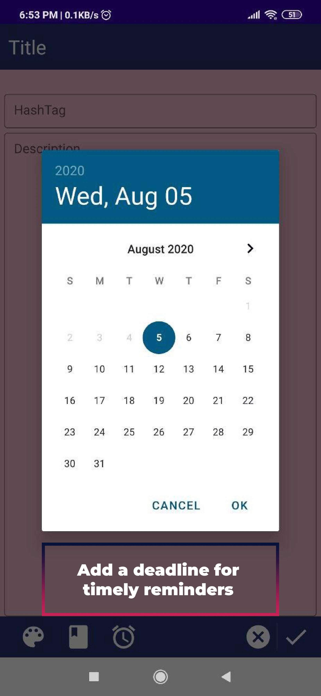 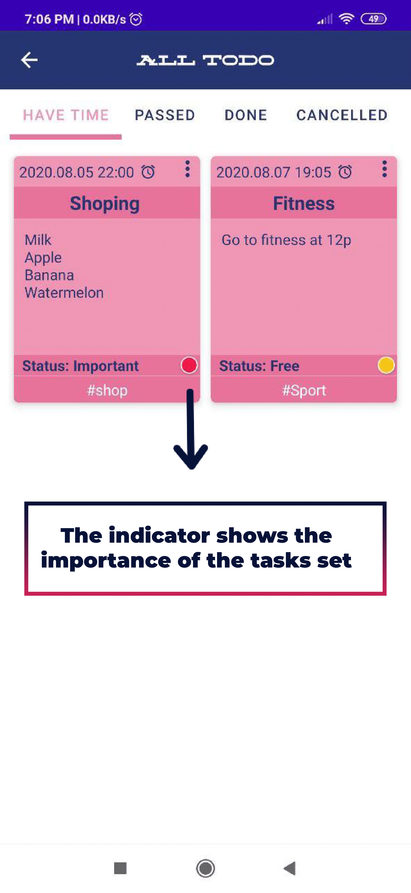

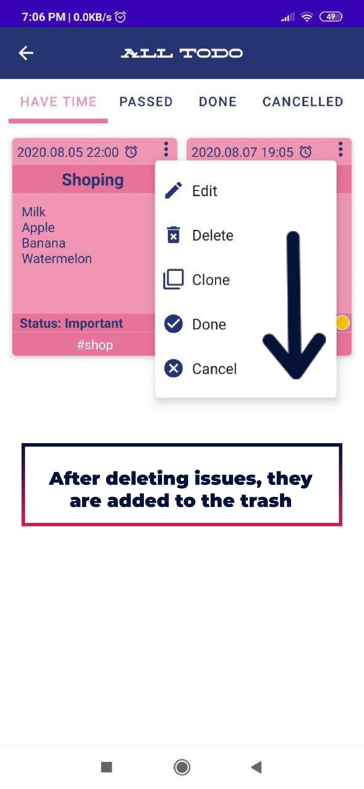 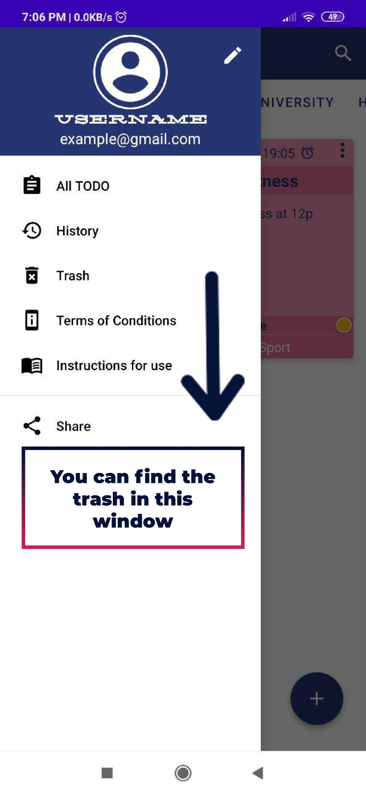

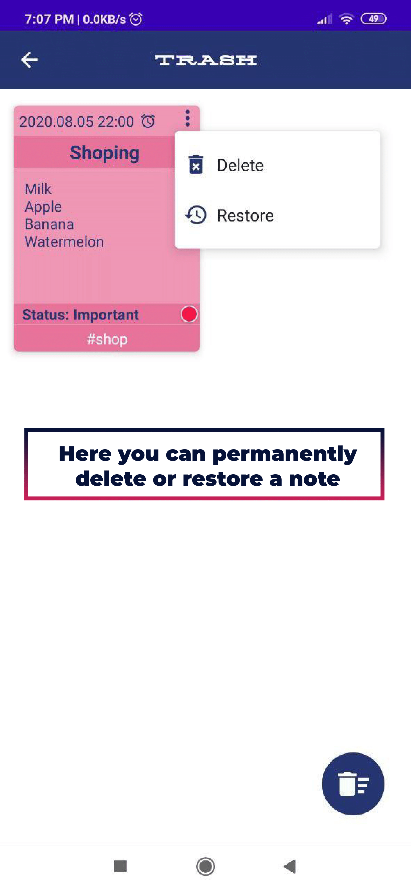 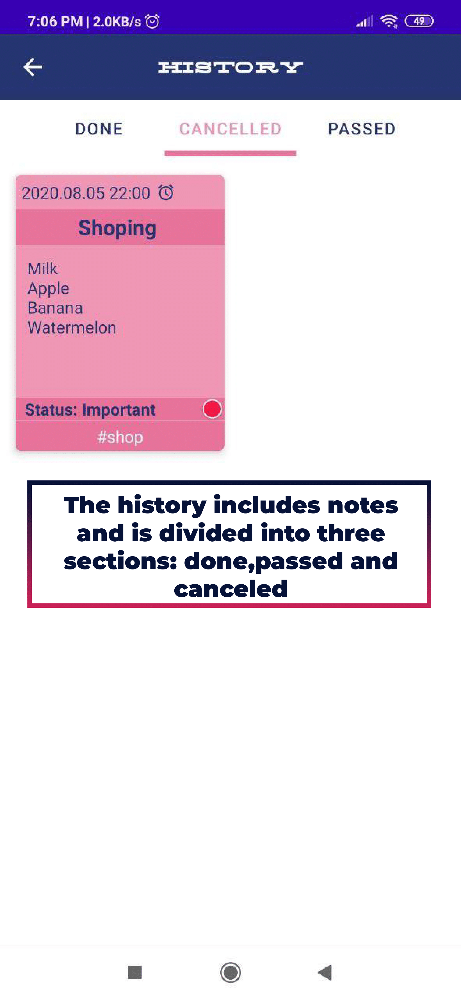

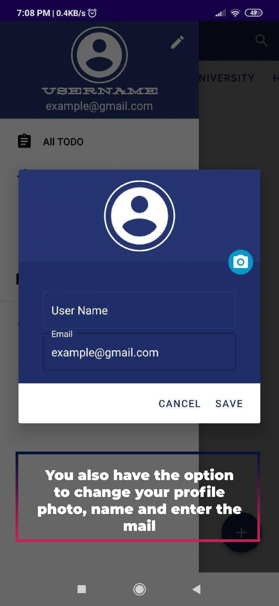 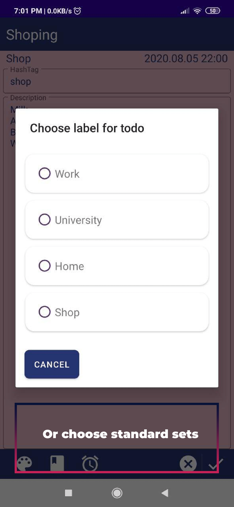

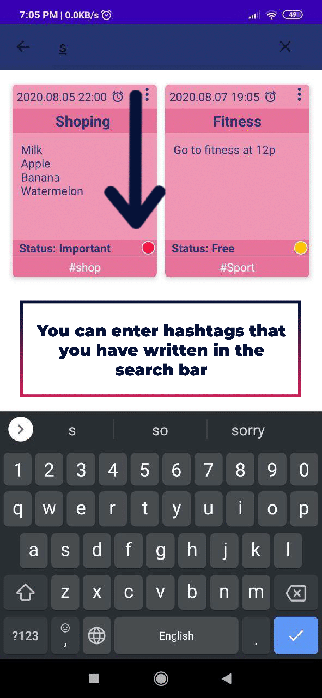 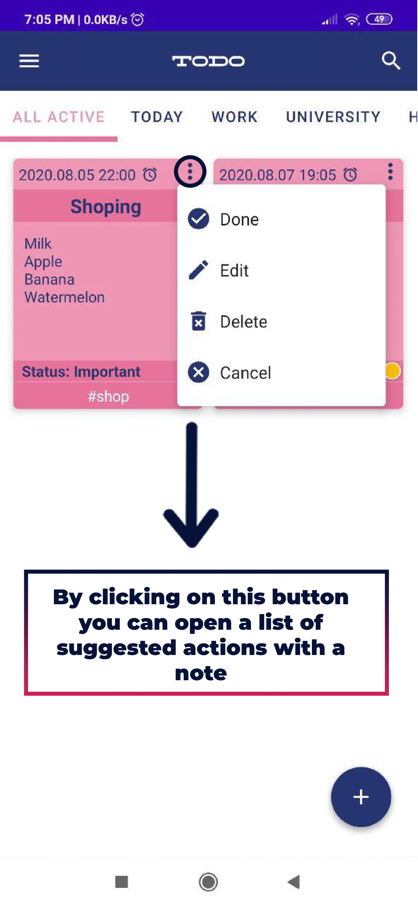
